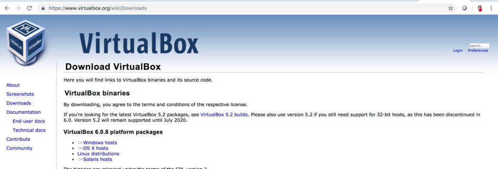
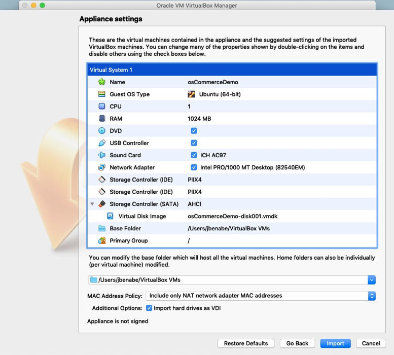
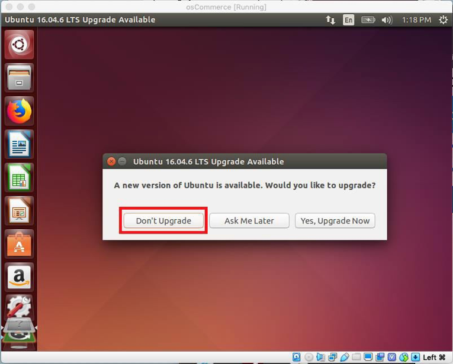

# Lab 100: Lifting A Third Party Application to the Cloud

## Introduction
This lab walks you through the steps to capture an image of an existing, on-prem third party application. First you will capture a .ova file of the application and convert it to a cloud compatible .vmdk file. From there you will import the .vmdk to Object Storage and then create a cloud-native server that will use the file as a custom image.

### Objectives
* Learn how to create a cloud-compatible VMDK file
* Learn how to leverage Object Storage
* Learn how to provision cloud infrastructure (networking, routing, compute)
* Learn how to deploy cloud-native servers

### Required Artifacts
* The following lab requires an Oracle Public Cloud account. You may use your own cloud account, a cloud account that you obtained through a trial, or a training account whose details were given to you by an Oracle instructor.
* [VirtualBox](https://www.virtualbox.org/wiki/Downloads)
* Preinstalled Ubuntu Virtual Image (Will be provided to you during workshop from OraDocs repository)
* VNC Viewer

Estimated time to complete this lab is three hours.

### Additional Resources
* To learn about provisioning Networks and Network Security check out this [link](https://docs.cloud.oracle.com/en-us/iaas/Content/Network/Concepts/overview.htm)
* To learn about Object Storage in the cloud please see the following [link](https://docs.cloud.oracle.com/en-us/iaas/Content/Object/Concepts/objectstorageoverview.htm)

## Part 1. Capturing a Snapshot of Third Party OS Commerce Application

### Step 1: Download VirtualBox and Import Ubuntu Instance
If you do not have it on your local machine, make sure to download [VirtualBox](https://www.virtualbox.org/wiki/Downloads). VirtualBox is a free, open-source software that allows users to run multiple operating systems on a single machine and switch between OS Instances. Additionally, download the [osCommerceDemo.ova file](https://objectstorage.us-ashburn-1.oraclecloud.com/p/8TW2UCWbLhdiqxSsarx47PImymazugfuZ48kDnevYq8/n/orasenatdecanational01/b/OsCommerce_ova_file/o/osCommerceDemo.ova). Please reach out to your lab facilitator should you have any issues downloading the .ova file.



Open Virtualbox and click File > Import Applicance. Select the .ova file downloaded earlier.


Double check that your settings match the screenshot below. Once confirmed, click the import button. This process should take approximately 5 minutes.



Once complete, you will see the osCommerceDemo virtual box listed. Hit the Green Start Arrow and you will be prompted with a login screen with username *oscommerce*. the Default password is *oscommerce*. Once logged in you may or may not be prompted to update to Ubuntu 16.04.6. Click on “Don’t Upgrade”. You have now successfully imported Ubuntu to VirtualBox that we will now use to initialize our osCommerce application.



If you you would like to increase the desktop view of the VirtualBox, click on the Gear icon on the top right of the Ubuntu instance. When the System Settings window opens, click on Displays. From here click on your preferred resolution and click apply. The resolution will then change. Click on “Keep This Configuration” to save changes. This will give you more screen space in case the default 800x600 (4:3) resolution was too small.


### Step 2: Install and Setup LAMP (Linux, Apache, MySQL, PHP) & SSH
**Verify Internet Connection**

Before installing any of the packages on the Ubuntu image on VirtualBox, make sure that you are connected to the public internet. Shut down the virtual machine, then disable/turn off any VPN applications/programs, then start up the Ubuntu Virtual machine. This will allow the Ubuntu Virtual Machine to download and install Linux packages.

**Install MySQL5**

Run this terminal command to install MySQL:
```
sudo apt-get install mysql-server mysql-client
```

You will be asked to provide a password for the MySQL “root” user – this password is valid for the user root@localhost as well as root@server1.example.com, so we don't have to specify a MySQL root password manually later on. NOTE: Write this password down. You will need it for multiple parts of the lab going forward.

Run this command to complete the installation:
```
mysql_secure_installation
```

After running the command you will also be asked to answer prompts within the terminal window. Enter the following below where the password is the one you just set:
```
Enter current password for root (enter for none): Type Root Password

Change The Root Password? N

Remove Anonymous Users? Y

Disallow Root Login Remotely? Y

Remove test database and access to it? Y

Reload Privilege Tables now? Y
```

**Install Apache2**

Run this command within the terminal on the VirtualBox environment:
```
sudo apt-get install apache2
```
If you direct your browser to localhost you will see the Apache2 placeholder page.


**Install PHP5**

Install PHP5 and Apache PHP5 modules with the command below:
```
sudo apt-get install php5 libapache2-mod-php5 php-mysql
```

If the above command doesnt work, use the following command
```
sudo apt-get install php5 libapache2-mod-php5 php5-mysql
```


Restart Apache:
```
sudo service apache2 restart
```

**Configure osCommerce Database and User**

Log on to the database as an administrator using the terminal within the VirtualBox environment:
```
mysql -u root -p
```
Create a database named oscommerce:
```
CREATE DATABASE oscommerce;
```

create a database user named oscommerceuser . Replace "type password here" with a password of your choice. In this example we used *oscommerce*  as our password for the sake of simplicity. Regardless of what you choose it is highly recommended that you **copy down your password** as you will need it for other portions of the lab. Please manually typing the following commands due to the formatting of apostraphes.
```
CREATE USER oscommerceuser@localhost IDENTIFIED BY 'type_password_here';
```
grant the user access to the database & flush privileges:
```
GRANT ALL PRIVILEGES ON oscommerce.* TO oscommerceuser@localhost;
FLUSH PRIVILEGES;
```
Exit with Control + C

**Configure Ubuntu for SSH Connections**

Setup SSH:
```
sudo apt-get install openssh-server sudo
apt-get install ssh
```
Install the below package to save persistent iptables updates. Select 'Yes' to save Firewall rules.
```
sudo apt-get install iptables-persistent
```
allow SSH Connection:
```
sudo iptables -A INPUT -p tcp --dport 22 -j ACCEPT
sudo iptables -A INPUT -p tcp --dport 80 -j ACCEPT
```
Check your iptables is updated with SSH access rules & save the updated rules:
```
sudo iptables -L
sudo invoke-rc.d iptables-persistent save
```


### Step 3: OSCommerce Setup
**Download OSCommerce**

Make a temporary folder named “tmp” where you will download osCommerce to. Download the zip and extract:
```
mkdir tmp
cd /tmp/ && wget http://www.oscommerce.com/files/oscommerce-2.3.4.zip
unzip oscommerce-2.3.4.zip
```
Next, run the commands below to copy osCommerce content to the default root directory for Apache2. You can choose to customize Apache2 root directory, but for this post, we’re going to use the default location which is at /var/www/html

```
sudo cp -rf oscommerce-2.3.4/* /var/www/html/
```
Change permissions on the files and give apache2 ownership of the root directory. Restart Apache:
```
sudo chmod 777 /var/www/html/catalog/includes/configure.php
sudo chmod 777 /var/www/html/catalog/admin/includes/configure.php
sudo chown www-data:www-data -R /var/www/html/
sudo service apache2 start
```

Open firefox and navigate to localhost/catalog. You should see the setup wizard; all steps in this installation need to be completed before we can move on. Follow screenshots below to make sure settings are consistent.


Start the new installation and log in to the MySQL database using the credentials created earlier. If values differ from those in the screenshot, please make sure you enter them appropriately.


Set where the www address and web server root directory should be saved


Finally, set the OSCommerce online store settings info. We recommend that you make a note of the administrator username and password for later reference.


After installation, remove the installation directory to protect your site and change the permissions on sensitive files:
```
sudo rm -rf /var/www/html/catalog/install
sudo chmod 644 /var/www/html/catalog/includes/configure.php
sudo chmod 644 /var/www/html/catalog/admin/includes/configure.php
```

### Step 4: Configure osCommerce for End User Use
Type localhost/catalog/admin in the address bar of the firefox browser you had open earlier. You'll need to log in with the admin username and password that you entered when setting up your osCommerce Online Store Settings. After logging in you'll be redirected to a page that looks similar to the second photo below.


**Create a New Manufacturer, Category & Product**

When logged in, click on “Catalog” on the right-hand menu and click on “Manufacturers”. On the next page, click on “Insert” and proceed to enter “Oracle” as the Manufacturer Name and upload an image of the Oracle logo (you can download one by using the firefox browser and saving it locally).  Click save when complete. You will then see Oracle as a listed Manufacturer with the image you uploaded.


Go to “Categories/Products” then “Hardware”, click “New Category”, and name it ‘Oracle Hardware’. Upload an image of the Oracle logo and click save when complete.


Go to “Categories/Products” then “Hardware”, click ‘Oracle Hardware’, then click ‘New Product’, and fill out the fields. Download an image, from the browser, of the product and save it to the pictures folder, to then attach to the new product. We selected ‘Oracle Exadata’ as our product.


Navigate to localhost/catalog/index.php. This is what you should see as a final product:


### Step 5: Export .Ova File From VirtualBox & Extract VMDK

From VirtualBox, shut down the osCommerce image (quitting out will also do this). Export the appliance from VirtualBox. Copy as seen in the image and set the file location for the .ova export. Keep in mind of the directory you are exporting to. Export will take about 5 minutes.


Open a Terminal window (on your local machine, **NOT in Virtualbox**)  and change directories to where the .ova file was exported. The pwd command was used to show you the current directory that terminal was in. Use the command below to unzip the .ova file:
```
tar -xvf [.ova file]
```
You should expect to see a .vmdk file after it unzips.


## Part 2. Bringing Snapshot to the Cloud

### Step 1: Create a Virtual Cloud Network (VCN)
**Note: If you so choose it may make sense to organize resources in a dedicated “OSCommerce” compartment. This is at the customer’s discretion, but if so choose Identity->Compartments->Create Compartment. This will be the compartment where all resources for the lab will be housed.**

Login to your Oracle Cloud tenancy and in the top left hamburger menu you will find
“Networking.” Choose “Virtual Cloud Networks” from the list.


Select the option “Create Virtual Cloud Network.”


Select the option “Create Virtual Cloud Network Plus Related Resources.” This will generate the required resources for a publicly accessible subnet including default route tables, internet gateways, and security lists. All pre-generated resources will be displayed, e.g. “Create Internet Gateway.” Be choosing the related resources option we minimize additional config.


**Security List Config**

It's vitally important that we lock down this application as malicious third parties will exploit open ports if not configured correctly. In this instance the we need to set security list ingress and egress rules to control the types of traffic allowed in and out or the subnet- and OSCommerce instance. Specifically:
*	Allow Port 22 for SSH and 443 for HTTPS
*	Allow port 3306 for mysql

For production instances **never** open up all traffic via 0.0.0.0/0 on a given port. This will make your application extremely vulnerable to third party attackers. In this lab we will do this for the sake of easy configuration but it is highly recommended that after the lab you lock these ports down.


### Step 2: Create Object Storage Bucket
From the top left hamburger menu, expand the list and find “Object Storage.” Select Object
Storage from the secondary list and choose "create bucket." Enter a name for the bucket and click create Bucket with default settings for storage tier and encryption.


### Step 3: Upload VMDK File to Bucket & Create PAR
Select the bucket you created and then click the blue bottom within Objects named “Upload Objects.” Click “select files” and then locate the .vmdk file created previously from the unzipped .ova


Click the three dots next to the .vmdk file and select Create Pre-Authenticated Request. Leave the default selections and click Create Pre-Authenticated Request. If you would like this PAR to exist for an extended period of time, adjust expiration date accordingly.


Copy the pre-authenticated request URL. This will be used later when creating the custom image.


## Part 3: Create Custom Image and Instance

### Step 1: Import the image
From the top left hamburger menu, locate “Compute” and select “Custom Images” from the
drop down.Click the blue button and select "Import Image"


Select which compartment the image will be created in (if dedicated compartment was created, choose this one). Name the image & Select Linux for the operating system. Paste the Pre-Authenticated Request URL that was copied in the last step into the Object Storage URL field. Leave the default image type (VMDK) and Launch Mode (Paravirtualized). Process will take about 30 minutes to complete.


### Step 2: Create Instance with Custom Image

Click "Compute" -> "Instances." Click “Create Instance”, then “Change Image Source”, then “Custom Images”, and select the osCommerce custom image.


In “Configuring Network,” select the VCN created earlier and subnet. Make sure you click on the button for “Assign a public IP address”. Click the “Create” blue button at bottom of screen to create the instance.


Next, browse for your public SSH key on your computer. Drag and drop that public SSH key file. Locate this file to drop the public key, ‘.pub’ or paste the contents of the key.


If you need to generate an SSH key pair, use the command below and follow on screen instructions for:
```
ssh-keygen -t rsa -N "" -b "2048"
```
Press ‘Enter’ key for default file location. For Mac users, most likely, your public SSH key can be found in Users/<your name>/.ssh. If you cannot find this directory because it is hidden, run the following command to open the ssh folder:
```
open . ~/.ssh
```

### Step 3: Connect to Instance and Validate that it's Online
After the instance has been created, open terminal on your local machine and run this command to connect via SSH:
```
ssh –i <private_key_name> oscommerce@<public-ip-address>
```
Where private_key_name is the key linked to the instance and the public IP address can be pulled from the OCI console. The default password is *oscommerce*.

**Enable SSH and Disable Password Access**

From the connected instance open the sshd_config file (see command). Enter your administrative login password when prompted:
```
sudo nano /etc/ssh/sshd_config
```
Remove the "#" sign at the start of the PasswordAuthentication label and replace "Yes" with "No." The line should read PasswordAuthentication no.


Find the “UsePAM” label, and then replace "Yes" with "No" so that the line reads: UsePAM no


Run the following commands to save the file, restart the server and create the appropriate directories:
```
sudo service ssh restart
mkdir ~/.ssh
touch ~/.ssh/authorized_keys
```

Open the authorized_keys file and past your public key. Make sure to save and exit. Change permissions on the file:
```
sudo 600 authorized_keys
```

**Install Desktop Environment and VNC Server**

We can get the XFCE packages, along with the package for TightVNC, directly from Ubuntu's software repositories using apt:
```
sudo apt-get install xfce4 xfce4-goodies tightvncserver gnome-panel gnome-settings-daemon metacity nautilus gnome-terminal
```
Once the above command finishes, you will need to complete the VNC server's initial configuration. Enter the command:
```
vncserver
```

When prompted with “You will require a password to access your desktops”, put in a new password. We will use this new password when connecting to our instance via VNC Viewer. Select “n” when prompted “Would you like to enter a view-only password.”


Vncserver completes the installation of VNC by creating default configuration files and connection information for our server to use. With these packages installed, you are ready to configure your VNC server and graphical desktop.

**Configure VNC Server**

First, we need to tell our VNC server what commands to perform when it starts up. These commands are located in a configuration file called xstartup. Our VNC server has an xstartup file preloaded already, but we need to use some different commands for our XFCE desktop.

When VNC is first set up, it launches a default server instance on port 5901. This port is called a display port, and is referred to by VNC as :1. VNC can launch multiple instances on other display ports, like :2, :3, etc. When working with VNC servers, remember that :X is a display port that refers to 5900+X.

Since we are going to be changing how our VNC servers are configured, we'll need to first stop the VNC server instance that is running on port 5901:
```
vncserver -kill :1
```

Before we begin configuring our new xstartup file, let's back up the original in case we need it later. After we'll open the file itself with nano. Insert commands in the file so that they'll be run automatically.

```
mv ~/.vnc/xstartup ~/.vnc/xstartup.bak
nano ~/.vnc/xstartup
```

```
#!/bin/bash
[ -x /etc/vnc/xstartup ] && exec /etc/vnc/xstartup [ -r $HOME/.Xresources ] && xrdb $HOME/.Xresources xsetroot -solid grey
vncconfig -iconic &
x-terminal-emulator -geometry 80x24+10+10 -ls -title “$VNCDESKTOP Desktop” &
x-window-manager &

gnome-panel &
gnome-settings-daemon & metacity &
nautilus &
```

Save the file once the commands are properly pasted in. Press Control+X to save. When prompted to “Save modified buffer?”, Press Y. Do not change the name of the file. Press Enter to continue. Your file should look identical to the terminal command below.


**Create a VNC Service File**

To easily control our new VNC server, we should set it up as an Ubuntu service. This will allow us to start, stop, and restart our VNC server as needed. First, open a new service file in /etc/init.d with nano and copy the following code into the file (reference screenshot).
```
sudo nano /etc/init.d/vncserver
```

```
#!/bin/bash
PATH="$PATH:/usr/bin/"
export USER="oscommerce" DISPLAY="1"
DEPTH="16" GEOMETRY="1024x768"
OPTIONS="-depth ${DEPTH} -geometry ${GEOMETRY} :${DISPLAY} -localhost"
. /lib/lsb/init-functions
case "$1" in start)
log_action_begin_msg "Starting vncserver for user '${USER}' on localhost:${DISPLAY}" su ${USER} -c "/usr/bin/vncserver ${OPTIONS}"
;;
stop)
log_action_begin_msg "Stopping vncserver for user '${USER}' on localhost:${DISPLAY}" su ${USER} -c "/usr/bin/vncserver -kill :${DISPLAY}"
;;
restart)
$0 stop
$0 start
;;
esac exit 0
```


Once all of those blocks are in your service script, you can hit Ctrl and ‘X’ to exit, press ‘Y’ to
save and press enter to save and close to the file. **NOTE: Please confirm that the copy & past reflects the above screenshot**. To make this service script executable and then to start a new VNC instance run the below commands:
```
sudo chmod +x /etc/init.d/vncserver
sudo service vncserver start
```

**Connect to your VNC Desktop**

tunnels. If you are using Windows, you could use TightVNC, RealVNC, or UltraVNC. Mac OS X users can use the built-in Screen Sharing, or can use a cross-platform apps like RealVNC, or VNCViewer. For this lab, we chose to use VNCViewer.

First, we need to create an SSH connection on your local computer that securely forwards to the localhost connection for VNC. Open a new terminal window and input this command:

(Remember to replace <username> and <pubic_ip_address> with the username and IP you used to connect to your server via SSH.)
```
ssh -L 5901:127.0.0.1:5901 -N -f -l <username> <public_ip_address>
```

If you are using a graphical SSH client, like PuTTY, use <public_ip_address> as the connection IP, and set localhost:5901 as a new forwarded port in the program's SSH tunnel settings. Next, we’ll use VNC Viewer to create a new VNC Server. Create a new connection and set the VNC server to localhost:5901 and set the name to “osCommerce Demo.” Make sure you don't forget that :5901 at the end, as that is the only port that the VNC instance is accessible from. When prompted for a password, use the password that you set earlier. You should see the default desktop!

*Important*: On your server it will tell you which port is in use (e.g. New ‘X’ desktop is
oscommerce-VirtualBox:1) In this case it will be port 1 = 5901. If it was :2 then it will be 5902.

*Debug*: If the pipe is broken for your local terminal instance. SSH into the ubuntu instance and kill the previous vncserver instance. Replace :1 with the instance number created.

```
vncserver -kill :1
```


**Confirm Customized OsCommerce App is Running**

Open Firefox and enter in “localhost/catalog/index.php”. If you see a similar window as shown in the photo below, you have successfully completed this lab!


