# Lab 300: Integrate Oracle Cloud Platform services with your app

## Introduction
This lab walks you through the steps to integrate your third party app with Oracle Cloud PaaS. First, we will connect MySQL database and then Oracle Autonomous Data warehouse to Oracle Integration Cloud. After both the connections has been established, we will migrate the data from MySQL database to Oracle Autonomous Datawarehouse. Lastly, we will connect Oracle Analytics Cloud service to Oracle Autonomous Data warehouse to perform some analytics.

### Objectives
* Establish connection from MySQL to Oracle Integration Cloud
* Establish connection from Oracle Autonomous Database and Oracle Integration Cloud
* Establish an integration between the ADW and MySQL connections
* Create an OAC Instance
* Access your new OAC Instance
* Connect an ADW/ATP Instance to OAC

### Required Artifacts
* The following lab requires an Oracle Public Cloud account. You may use your own cloud account, a cloud account that you obtained through a trial, or a training account whose details were given to you by an Oracle instructor.
* Complete Lab 100 and 200
* Access to Oracle Integration Cloud Service
* Access to Oracle Autonomous Data Warehouse
* Access to Oracle Analytics Cloud Service

Estimated time to complete this lab is two hours.

### Additional Resources
* To learn about Oracle Integration Cloud Service, check out this [link](https://docs.oracle.com/en/cloud/paas/integration-cloud/index.html)
* To learn about Autonomous Database, see the following [link](https://www.oracle.com/database/autonomous-database.html)

## Part 1. Establish connections in Oracle Integration Cloud

### Step 1: Establish connection from MySQL to Oracle Integration Cloud

Before moving forward, if you have been provided a wallet file, a username, and password to an ADW or ATP, please save this information and continue to the next step. Otherwise, read the step below:

If you have not been provided a username, password, and wallet file, please follow the lab guide here [link](https://github.com/oracle/learning-library/blob/master/workshops/erp-adw-oac/LabGuide100ProvisionAnADWDatabase.md). Once you complete making an ADW or ATP instance, please download the Wallet file from the console.

Here, we will establish a connection between our MySQL Database and Oracle Integration Cloud. An Oracle Integration Cloud instance will be provided to you.
In the Oracle Integration Cloud home page, click on the Menu icon in the top left and click on Integration.

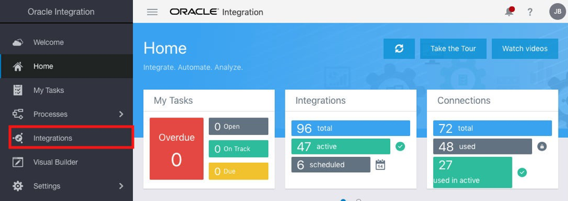

When the webpage finishes loading, click on “Connections” and click on create.

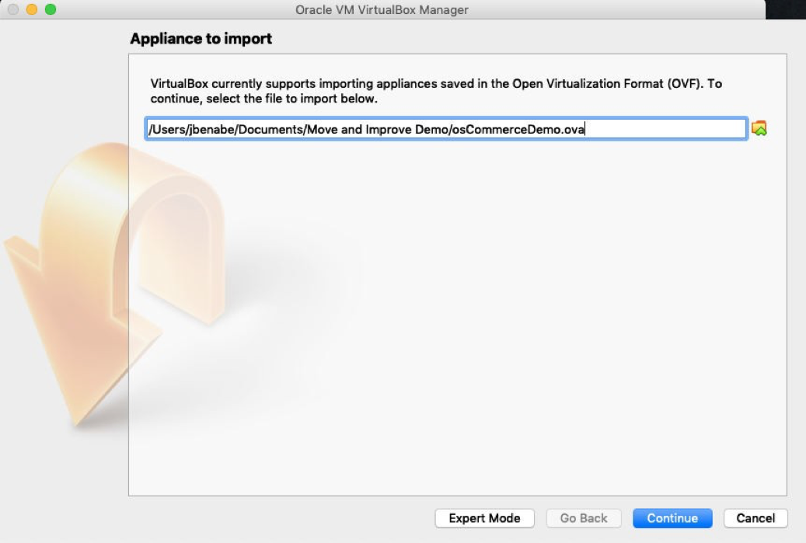

A new window will load. On the top right, search for “MySQL” and you will be able to select MySQL as your adapter. Click on the “Select” button and you will be redirected to the “Trigger and Invoke” page.

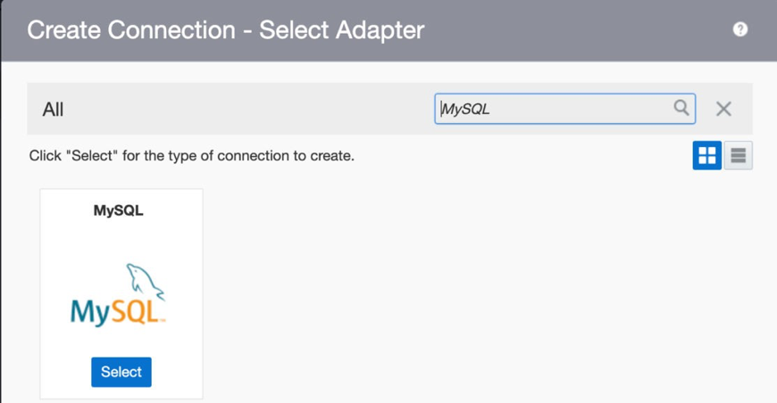

On this page, name your connection. In this lab, we used “MySQL_osCommerce”. Feel free to add a Description to this connection if you’d like. For the role, make sure that “Trigger and Invoke” is enabled.

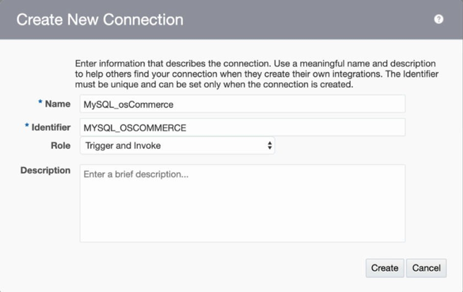

In the next page, you will be asked to provide information for Connection Properties, Security, and Agent Group. To edit these, click on their respective Configure button and enter the following information:
Host: This will be the public IP to your compute instance
Port: Use port 3306 since this is a MySQL database
Database Name: oscommerce. This is the database name we used in Step 2
Username & Password: Use the credentials that you used in Step 2
Agent Group: In the Oracle Integration Cloud instance, there will be an Agent Group preconfigured for you. Select that one. If there is no agent, follow the steps from this [link](https://docs.oracle.com/en/cloud/paas/integration-cloud/integrations-user/agent-download-and-installation.html#GUID-72491B67-7445-4B52-94FA-CEC8488E0F4A) to install a new agent. 

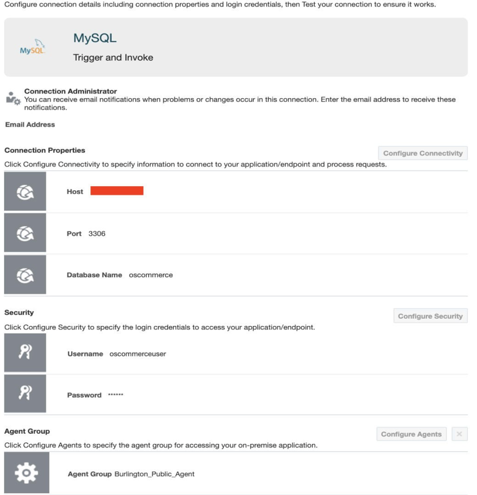

### Step 2: Establish connection from Oracle Autonomous Database and Oracle Integration Cloud

Creating a connection between an Oracle Autonomous Database and Oracle Integration Cloud is a very similar process to creating a connection between our MySQL database and OIC. Within our ADW instance, we have already created some tables that will be used later in this lab.

Click on the same create button under the Connections tab and search for your respective Oracle Autonomous Database, either Autonomous Transaction Processing or Autonomous Warehouse. In this lab, we chose an Oracle Autonomous Transaction Processing database.

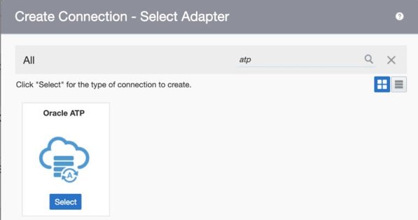

In the next window, you will need to provide your Oracle Database wallet file, and its respective credentials. Then you will need to manually type in the Service Name, either High, Medium or Low (these are specific to concurrent queries, but for our purposes does not matter).

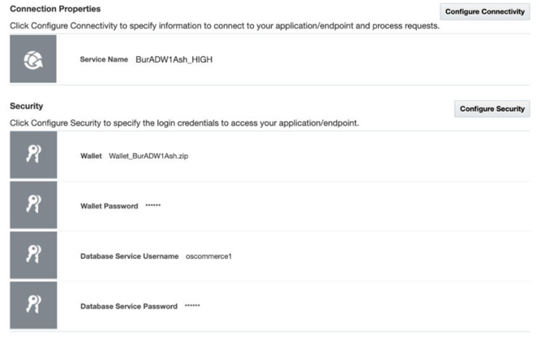

### Step 3: Establish an integration between the ADW and MySQL connections

Now that we have both connections made in Oracle Integration Cloud for our MySQL and Autonomous Database, we will need to establish an integration for both to communicate with each other.

Back on the Designer Tab, click on “Integrations”. When you are in the Integrations tab, click
on create

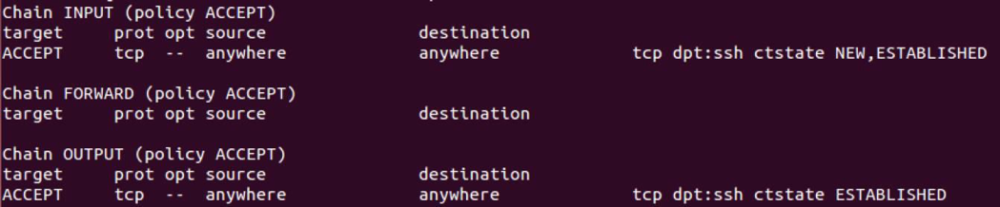

When you click on Create, you will need to Select a Style. Select Scheduled Orchestration
and click on the Select button.

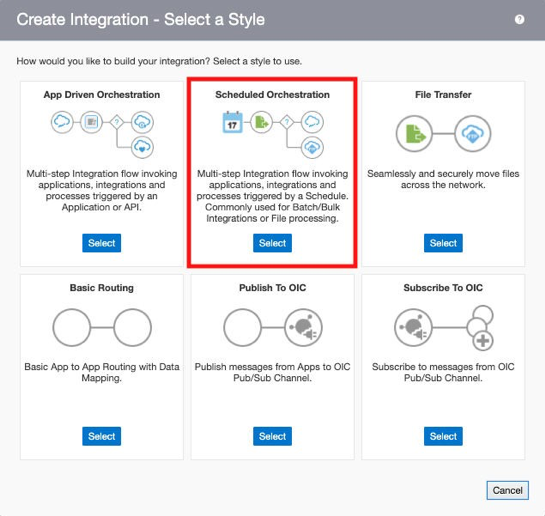

For your new integration, give it a name of your choosing. In this lab, we chose
MySQL_to_ADW_OIC.

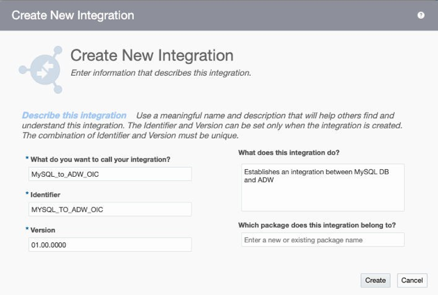

After clicking on create, you will be presented with a scheduled operation map. Click on the
plus icon and search for the MySQL connection that we made earlier.

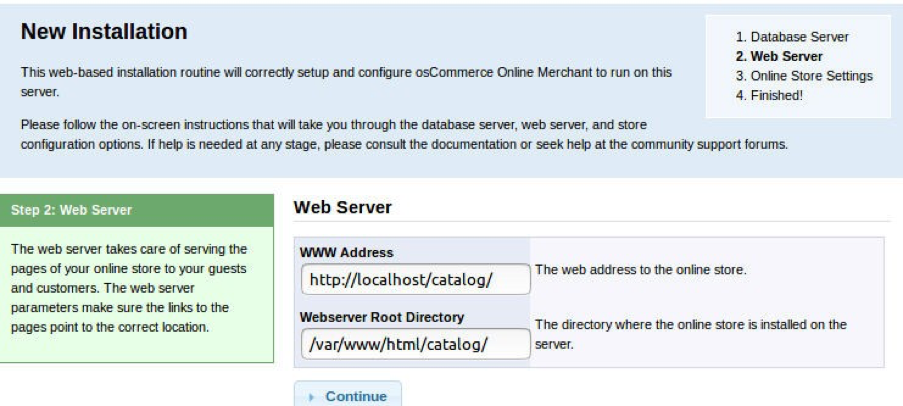

Name the endpoint and give the endpoint a description. Make sure that “Perform an Operation On a Table is selected. Lastly, make sure that the “Select” button is selected. Once you have put in the correct information, click on the “Next” button.

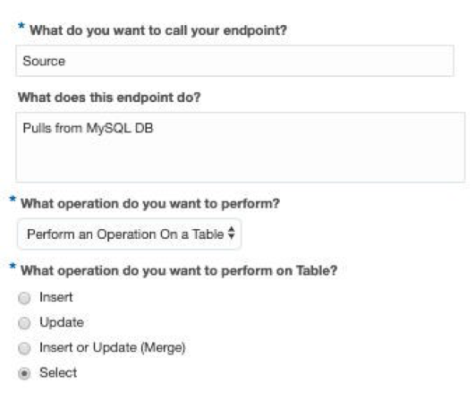

Under Schema, select osCommerce”. Next, you will need to select which tables you would like to pull information from. In this lab, we selected the “Products” table. When you have selected what table you would like to use, click on the > icon in the middle and it will add your selected table to the Selected list box. Then, click on Import Tables. Once that is complete, click on “Next”, as well as on the next window that shows up.

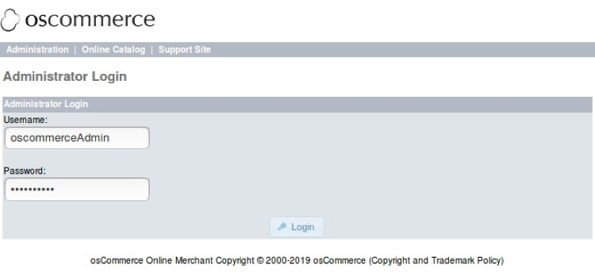

When you finish clicking on Next, make sure that all the information in the last page is correct.
Click “Done” if all information is correct.

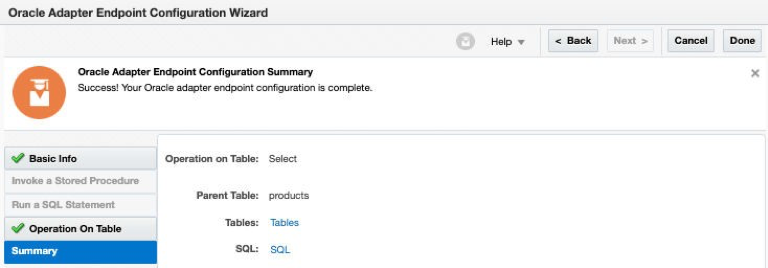

After completing the first step in the Orchestration, you will see the MySQL endpoint on the map. Between the MySQL source and the stop icon, you will click on the plus icon and search for the ADW connection we made previously.

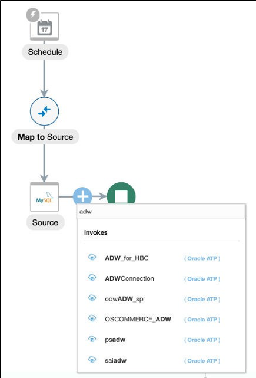

Name this endpoint and add a description if you’d like. Make sure that the “What operation do you want to perform?” option is “Perform an Operation on a table”. Next, select “Insert”. Click Next to continue.

For the schema, select “osCommerce”. Next, search for the Products tables and click on the
> icon in the middle and it will add your selected table to the Selected list box. Click on Import Tables and click on Next to continue. Once that is complete, click on “Next”, as well as on the next window that shows up.

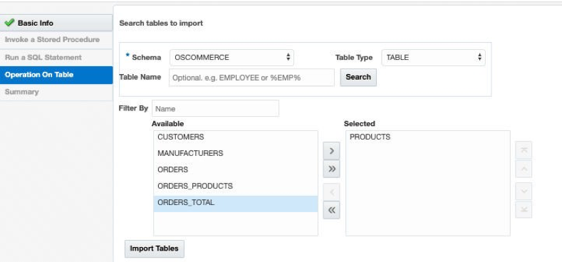

When you finish clicking on Next, make sure that all the information in the last page is correct.
Click “Done” if all information is correct.

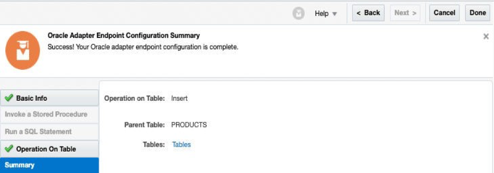

After clicking done, you will be brought back to the orchestration map. Click on “Make to Destination”, and then click on the pencil icon. Here, we will map the columns from the Products table in our MySQL database to the columns from the Products table in the ADW instance we have.

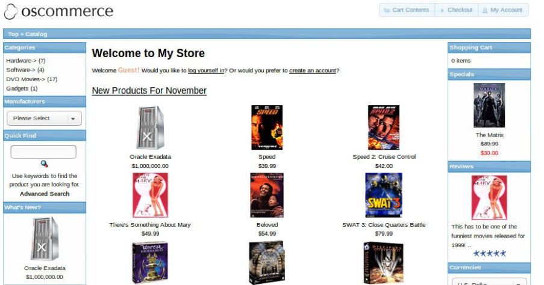

To map the Products table in the MySQL database to its respective Products table in the ADW, you will have to drag and drop each column individually to its respect column from the Source field, to the Target field, as shown in the image below. Once that has been completed, click on Validate to make sure there are no errors. When you are complete, click Close. It will save any changes made.

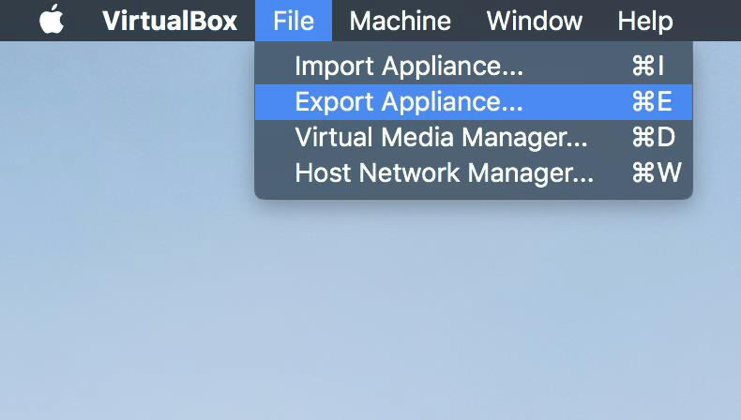

Back on the orchestration map, click on the Menu icon on the top right of the map window. Click on “Tracking”.

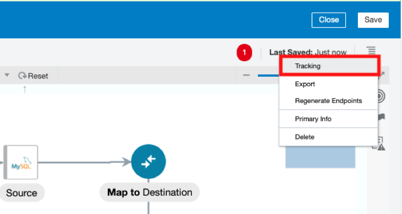

After clicking on “Tracking”, you will be prompted with this window. You will need to drag and drop the “<> startTime” item to the first line in the Tracking Field column.

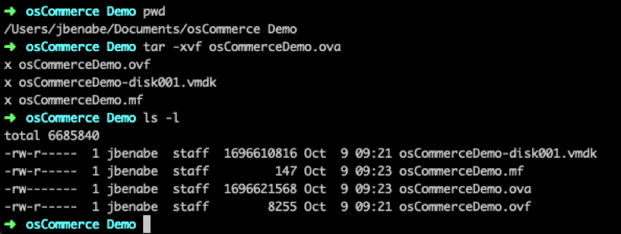

Once all mapping is complete, you will need to go back to the integration tab to view the list of all integration in the OIC instance you are in. If everyone was done correctly, you should see a Slider. Click on the slider to begin the Integration.

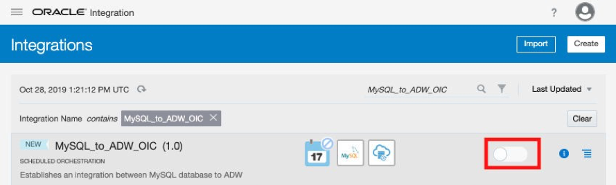

Once the slider is clicked, you will be prompted with this window below. Click on Enable tracing and Include Payload. Once both are selected, click on Activate.

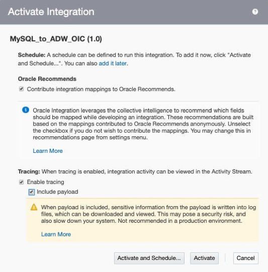

Once you click on Activate, the slider should now be moved to the right and be highlighted in Green. To submit the integration and for it to run, click on the menu icon on the same row as the integration you just created. Click on Submit Now.

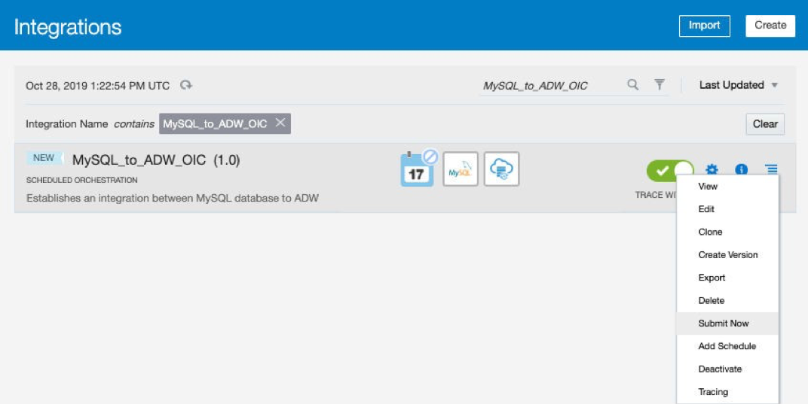

## Part 2. Connect your app to Oracle Analytics Cloud

### Step 1: Create an OAC Instance

Go to cloud.oracle.com, click the Sign In icon to sign in with your Oracle Cloud account. From here, click on Sign in to Cloud

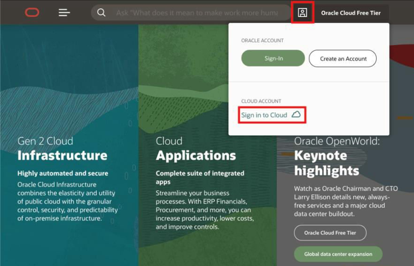

Enter your Cloud Account Name and click on Next

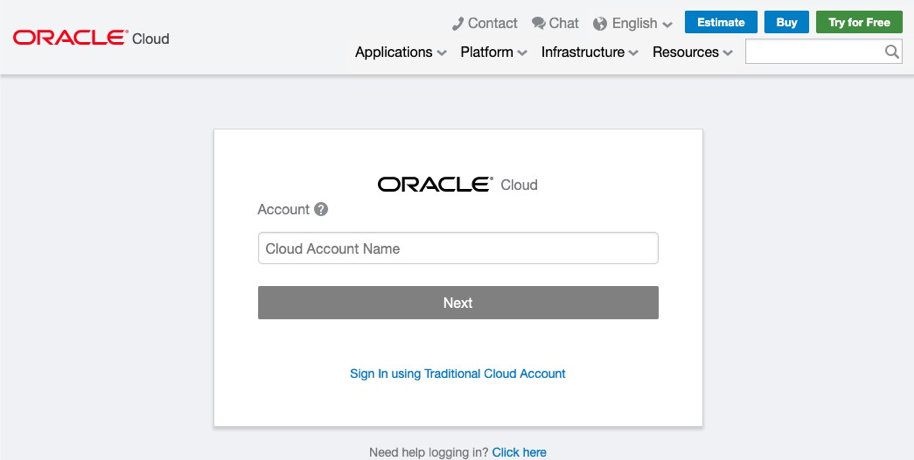

Enter your Oracle Cloud username and password, and click Sign In

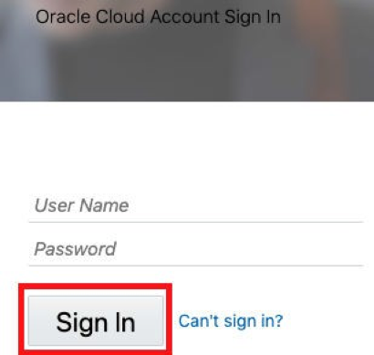

Once you are logged in, you are taken to the cloud services dashboard where you can see all the services available to you.

Click the navigation menu in the upper left to show top level navigation choices.

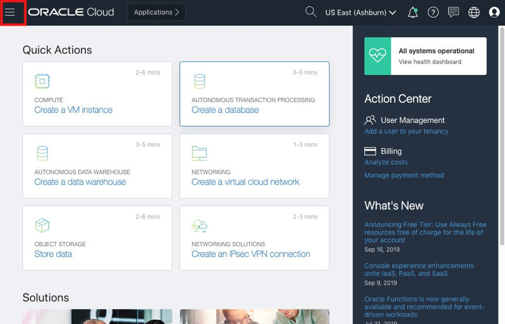

Scroll down and under More Oracle Cloud Services, hover your cursor on top of Platform Services. After hovering on Platform Services, click on Analytics and a new tab will open in your browser

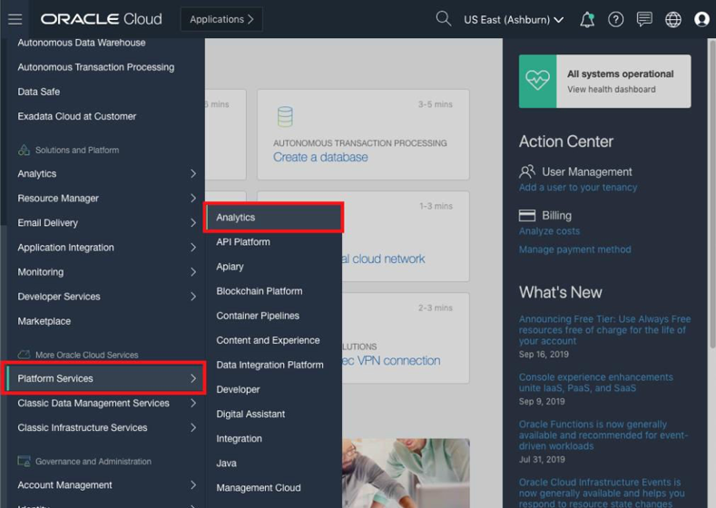

The Oracle Analytics console will list any existing Analytics Instances below. Here, you can search for a specific instance that you are looking for. If this is your first time setting up an instance, there will be none listed. To create a new Oracle Analytics Cloud instance, click on Create Instance

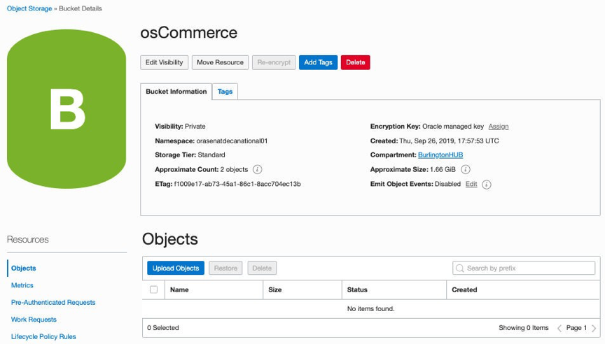

In this new page, you will need to put in information related to the OAC instance you are creating. For Region, pick which data center you would like this OAC to be on. For License Type, if you your company owns Oracle middleware, you are able to Bring Your Own License (BYOL). If you or your company does not own any Oracle Middleware, provide that information when prompted. For Edition, select which edition that is best suited for your needs. Hover your cursor over each Edition or click on the “?” icon to read a short description of each. For Feature Set, pick which one is best suited for your business needs. Lastly, pick the Number of Oracle CPUs (OCPUs) you need, based off of your business needs. Once you type in the required information and select your preferred options, click Next

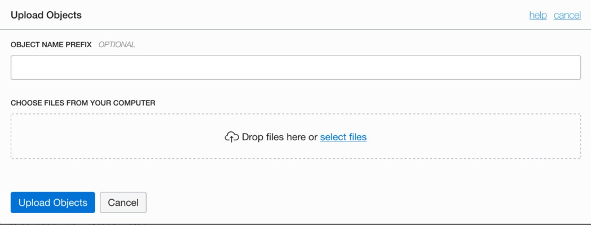

Confirm that all information is correct. If you need to make any additional changes, click the
Previous button. Once confirmed, click on Create

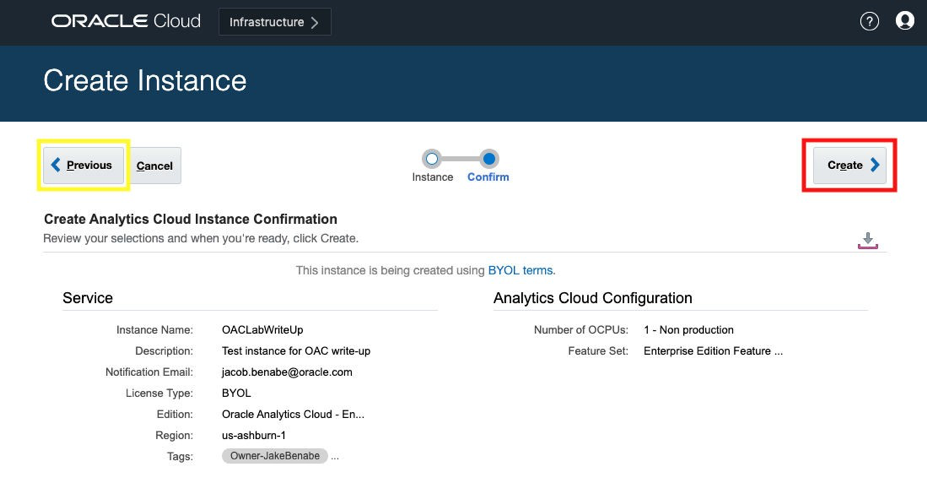

Once you click Create, you will be redirected to the first dashboard that lists all instances. As you can see, since we just began provisioning our instance, the current status says: Creating service. Once your instance is ready to be used, you will receive an email to the email address you provided when creating the instance.

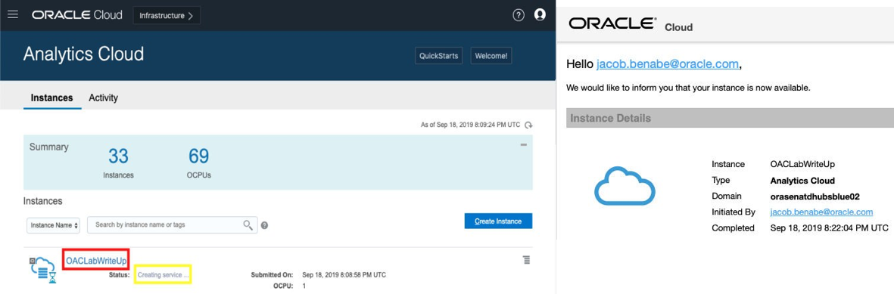

### Step 2: Access your new OAC Instance

Make sure you are on the dashboard for Oracle Analytics cloud. Click on the Hamburger icon on the same line as the instance you recently made. Click on Oracle Analytics Cloud URL. You will then be redirected to the main page for your OAC Instance

When redirected, your page should look similar to the picture below. If you get a similar page, congratulations! You can now start using OAC for your business needs!

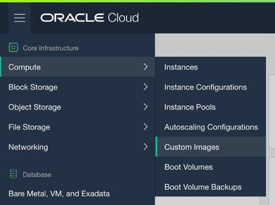

Note: If your page is not loading properly, or you are unable to access this page, disable any AdBlock extensions or programs that are running in the background, and refresh the page.

### Step 3: Connect an ADW/ATP Instance to OAC

To connect an ADW instance to OAC, from the dashboard, click on Create. A new window will open, where you will need to select what type of database you are using. In this example, we picked Oracle ADW.

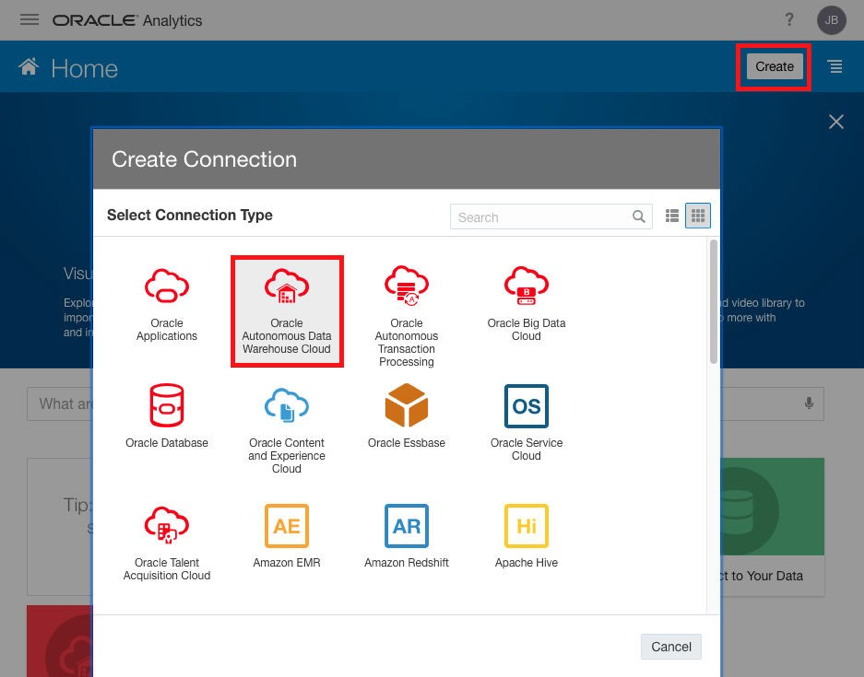

Fill in all required information to establish a connection to your ADW/ATP instance.
Select the wallet that you downloaded in the previous step. The credentials for username and password will be the specific user you want to log in as to the database, NOT the administrator credentials. For the Service Name, search for the name of the ADW/ATP instance name and select either high, medium, or low. Click on save and your connection should be established.

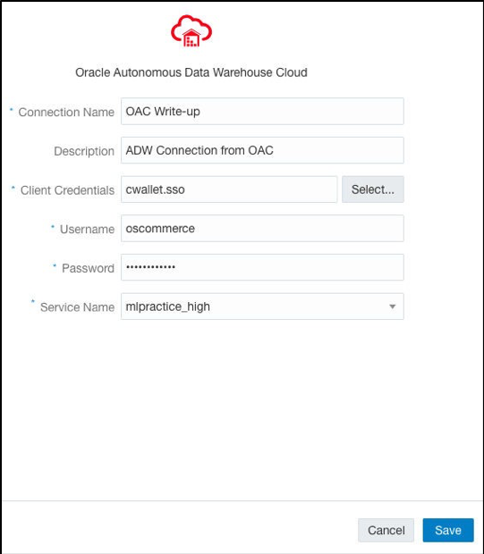

To see if your connection to your ADW/ATP instance was successful, go back to the OAC Dashboard, click on the hamburger menu in the top left, and click on Data. From there, you will need to click on the Connections tab. Your connection should be listed below

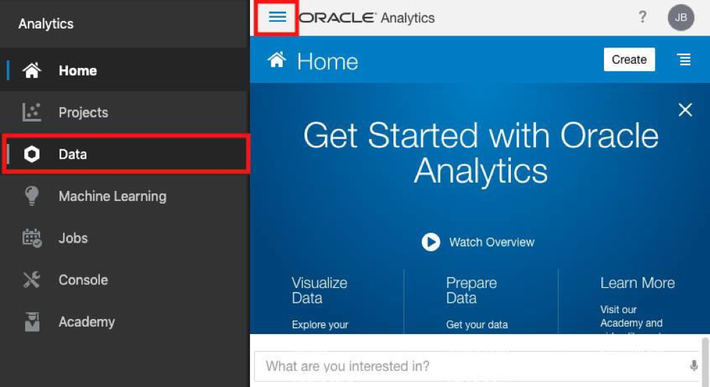

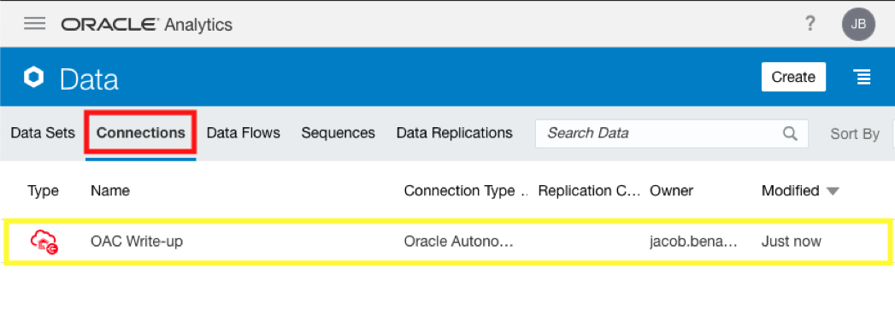
